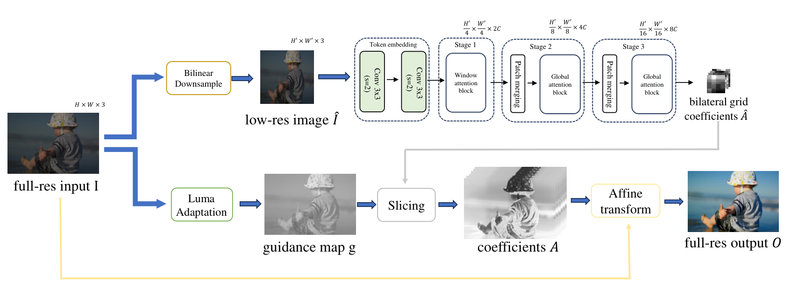

# Rethinking Affine Transform for Efficient Image Enhancement: A Color Space Perspective
By [Di Li](https://scholar.google.com/citations?user=r6WfS2gAAAAJ), and [Susanto Rahardja](https://scholar.google.com/citations?user=OdkA4jMAAAAJ&hl=en) 

## Introduction
The codebase provides the official PyTorch implementation for the paper ["Rethinking Affine Transform for Efficient Image Enhancement: A Color Space Perspective"](https://ieeexplore.ieee.org/document/10812861) (accepted by IEEE Transactions on Multimedia).

<p align="center">
  
</p>

## Dependencies 

- Python 3 (Recommend to use [Anaconda](https://www.anaconda.com/download/#linux))
- [PyTorch >= 1.0](https://pytorch.org/)
- Opencv
- Imageio

## Datasets

The paper use the [FiveK](https://data.csail.mit.edu/graphics/fivek/) and [PPR10K](https://github.com/csjliang/PPR10K) datasets for experiments.

- FiveK : You can download the original FiveK dataset from the dataset [homepage](https://data.csail.mit.edu/graphics/fivek/) and then process images using Adobe Lightroom.
  - To generate the input images, in the Collections list, select the collection Input `with Daylight WhiteBalance minus 1.5`.  
  - To generate the target images, in the Collections list, select the collection `Experts/C`.  
  - All the images are converted to `.PNG` format.

- PPR10K: You can download the train_val_images_tif_360p PPR10K dataset from the dataset [homepage](https://github.com/csjliang/PPR10K).
  - We used the 360p resolution images as the training and testing resolution. One can find the files by downloading `train_val_images_tif_360p` dataset (around 91GB). We choose the `expert_b` results as groundtruth.
  - Following the original paper, we train with the first 8,875 files and validate with the last 2286 files.

The final directory structure is as follows.

```
./train/
    input/         # 8-bit sRGB train inputs
    output/        # 8-bit sRGB train groundtruth
./eval/
    input/         # 8-bit sRGB eval inputs
    output/        # 8-bit sRGB eval groundtruth
```
## Train

- run
```bash
python train.py --train_data_dir ./train --eval_data_dir ./eval  --epochs=100 --cuda --gpu_ids 0
```

## Test
- run
```bash
python test.py --eval_data_dir=./test --cuda --ckpt_path ./result/ckpts/epoch_100_iter_112500.pth --gpu_ids 0
```

## Citation
If you find this repository useful, please kindly consider citing the following paper:

```BibTeX
@ARTICLE{10812861,
  author={Li, Di and Rahardja, Susanto},
  journal={IEEE Transactions on Multimedia}, 
  title={Rethinking Affine Transform for Efficient Image Enhancement: A Color Space Perspective}, 
  year={2024},
  volume={},
  number={},
  pages={1-12},
  doi={10.1109/TMM.2024.3521826}}
  ```

## License

Our project is licensed under a [MIT License](LICENSE).